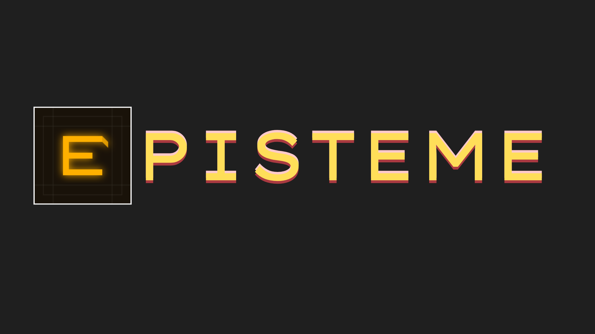

<div align="center">




<br/>

<div align="justify">


> **AI that refuses to answer your questions,** 
> **and instead helps you answer them yourself.**  
> **AI that refuses to answer your questions**  
> **and instead helps you answer them yourself.**

</div>

[](https://episteme.vercel.app)
[](https://nextjs.org)
[](https://anthropic.com)
[](https://supabase.com)

<br/>

> *Built in 24 hours · CBC Spring 2026 Global Hackathon · Track 3: Economic Empowerment & Education*  
> *78 universities · 12 countries · Themed on Dario Amodei's "Machines of Loving Grace"*

</div>

---

## `// INDEX`

| № | Section |
|---|---------|
| 01 | [The Problem : Why This Exists](#01--the-problem) |
| 02 | [The User : Who We're Building For](#02--the-user) |
| 03 | [What Episteme Does](#03--what-episteme-does) |
| 04 | [The 7 Research-Grade Algorithms](#04--the-7-algorithms) |
| 05 | [System Architecture](#05--system-architecture) |
| 06 | [How It Beats Prompt Engineering](#06--vs-prompt-engineering) |
| 07 | [Technical Stack](#07--technical-stack) |
| 08 | [Database Schema](#08--database-schema) |
| 09 | [API Reference](#09--api-reference) |
| 10 | [Export & Integrations](#10--export--integrations) |
| 11 | [The Metacognitive Agent](#11--the-metacognitive-agent) |
| 12 | [Ethical Design](#12--ethical-design) |
| 13 | [Impact & Scale](#13--impact--scale) |
| 14 | [Setup & Local Development](#14--setup--local-development) |
| 15 | [Roadmap](#15--roadmap) |
| 16 | [Research Foundations](#16--research-foundations) |

---

## `01 // THE PROBLEM`

<!-- REPLACE WITH CANVA: Two-column split card : left side: dark void background with large red ✗ 
     and text "ANSWER-SEEKING"; right side: amber glow with ✓ and "UNDERSTANDING". 
     Amber divider line between them. Dimensions: 1280×400px -->

Every AI tool built in 2026 is optimising for the same thing: **user satisfaction**.

Fast answers. Instant gratification. The question resolved in seconds. And it works : users are happy, session lengths are short, feedback scores are high.

But user satisfaction and user growth are **mathematically opposite objectives.**

When a learner receives an instant answer, the productive discomfort that drives genuine understanding is permanently eliminated. The struggle : the moment of cognitive friction where a concept clicks : never happens. The learner pattern-matches the answer. They cannot reconstruct it. They cannot apply it under novel conditions. They cannot explain *why* it is true.

This is not a new problem. It is the Socratic problem, 2,500 years old:

> *"I know that I know nothing"* : the beginning of genuine understanding.

What is new is that AI has made the problem catastrophically worse. The most powerful answer machines in history are now available to every student with a phone. And the result is a generation that can retrieve any fact but cannot reason about any of them.

**Episteme is built on a single, unfashionable conviction: the AI that refuses to answer your question is more valuable than the one that does.**

---

## `02 // THE USER`

<!-- REPLACE WITH CANVA: Profile card in amber-terminal style : dark card with amber accent bar on left,
     avatar silhouette, name "Rohan", key stats in monospace. Dimensions: 800×500px -->

```
┌─────────────────────────────────────────────────────────────┐
│  // USER PROFILE                                            │
├─────────────────────────────────────────────────────────────┤
│  NAME       Rohan, 22                                       │
│  LOCATION   Jhansi, Uttar Pradesh , India                   │
│  GOAL       ML Engineer role · GATE DA 2026                 │
│  HAS        Internet · 4 hrs/day · ChatGPT · Determination  │
│  MISSING    A mentor. Anyone to push back on him.           │
│  PROBLEM    Gets answers. Cannot reason about them.         │
└─────────────────────────────────────────────────────────────┘
```

Rohan is not a hypothetical. He is every student who:

- Can define gradient descent but cannot explain what happens when the learning rate is too high
- Knows what overfitting means but cannot design a solution for a novel dataset
- Can recite the Bayes theorem formula but cannot apply it to a real inference problem
- Has prepared for 6 months and still fails the ML interview because they pattern-matched, not reasoned

**The population:** 50 million+ self-learners in India : students preparing for entrance exams, placement interviews, and career transitions in STEM : who have internet access but no mentor, no coaching institute, no one to ask "but *why* do you think that?"

**The number:** In an internal reddit DS cohort survey (2025), 72% of students reported they could explain ML algorithms but could not reason about when they fail or why they are chosen for a given problem.

This is not an access problem. Every student has Claude, Gemini, Perplexity. **This is a cognitive scaffolding problem.** And no existing tool addresses it.

---

## `03 // WHAT EPISTEME DOES`

<!-- REPLACE WITH CANVA: 5-step horizontal flow diagram in amber-terminal style. 
     Each step is a dark card with amber number and monospace label.
     Connecting lines in amber between cards. Dimensions: 1280×300px -->

Episteme runs a formal **Socratic dialogue** : a structured, turn-by-turn conversation where the AI never directly answers your question. Instead, it:

```
STEP 01 → CLASSIFY        Your question is analysed for cognitive depth
                          SURFACE · CONCEPTUAL · ANALYTICAL · SYNTHESIS

STEP 02 → PROBE           "Before I respond : what do you already think?"
                          Turn 1 always begins here. No exceptions.

STEP 03 → TRACK           Every response is scored. Bayesian mastery 
                          estimate P(L) updates in real time.

STEP 04 → ADAPT           The dialogue state machine shifts strategy:
                          SCAFFOLD when confused · DEEPEN when strong
                          RECTIFY when misconception detected

STEP 05 → SYNTHESISE      After 4-6 turns: an insight card.
                          What you understand. What gaps remain. 
                          What to explore next.
```

### A Real Exchange

```
USER      → "For getting the range of the funciton f(g(x)) we first define the range of g(x) between the intervals a to b , if f(x) is increasing between a to b , we directly apply, f on g(x) , but if f is found to be decreasign, the inequality changes why?"

EPISTEME  → "Before I respond to why the inequality changes when f is decreasing, what's your intuition about what happens to order relationships when you apply a decreasing function to both sides of an inequality? For instance, if you know that 2 < 5, and you multiply both sides by -1 (a decreasing operation), what happens to the inequality sign and why do you think that occurs?"

USER      → "The inequalities will switch"

EPISTEME  → "You're right that inequalities switch with decreasing functions. Now let's connect this to your original question about composite functions. When you have g(x) with range [a,b] and you're finding the range of f(g(x)), you mentioned that if f is decreasing on [a,b], "the inequality changes." What specifically do you think is changing? Are you thinking about: - The inequality relating the inputs to g(x)? - The inequality describing the range bounds themselves? - Something else? Can you walk me through what inequality you see changing in this process?"

USER      → "Similar to the example given earlier, when a increasing function is taken inside a decreasing function, the range of the function inside is flipped across the ionequality as the outer function is decreasing for the saem range"

EPISTEME  → "There's a subtle thing here — you're thinking that when f is decreasing, we somehow "flip" the range of g(x) before applying f. The part that needs adjusting is this idea of flipping the range itself. When g(x) has range [a,b], that range doesn't change regardless of what f does. The values g(x) produces are still between a and b. Here's what I'm curious about: if g(x) can produce any value between a and b, and f is decreasing on [a,b], which value in the range [a,b] will give you the maximum output for f(g(x))? Which will give the minimum? Does your reasoning about "flipping the range" still hold given that the actual range of g(x) stays [a,b]?"

              [ DEPTH UPGRADE: SURFACE → CONCEPTUAL ]
              [ CLARITY: 46 → 74 ]
```

No other AI tool produces this exchange. Not because it is technically difficult to generate : but because every other tool is incentivised to give you the answer on turn one.

---

## `04 // THE 7 ALGORITHMS`

<!-- REPLACE WITH CANVA: Architecture diagram showing 7 algorithm blocks in a pipeline flow.
     Dark background, amber connecting arrows, each block has an ID and name.
     Pipeline flows left to right: USER INPUT → RDSE → BGDC → SDSM → SUV → CBKT-CS → CPGAB → EGP → CLAUDE
     Dimensions: 1280×400px -->

Episteme's intelligence is not in its prompts. It is in **7 deterministic algorithms** that run alongside every conversation : classifying, scoring, tracking, and steering the dialogue before Claude ever speaks.

```
USER MESSAGE RECEIVED
        │
        ▼
  ┌─────────────┐     6-feature scoring
  │    RDSE     │ ──► qualityScore [0-1]
  │             │     confusionCount [0-3]
  └──────┬──────┘     < 1ms · no API call
         │
         ▼
  ┌─────────────┐     Bloom's taxonomy fusion
  │    BGDC     │ ──► depthLevel
  │             │     keyword + LLM + embedding
  └──────┬──────┘     3-signal weighted vote
         │
         ▼
  ┌─────────────┐     7-state formal machine
  │    SDSM     │ ──► nextState
  │             │     PROBE/DEEPEN/SCAFFOLD/
  └──────┬──────┘     RECTIFY/REDIRECT/
         │            CONSOLIDATE/COMPLETE
         ▼
  ┌─────────────┐     Misconception detection
  │     SUV     │ ──► semanticAccuracy [0-1]
  │             │     misconception: string|null
  └──────┬──────┘
         │
         ▼
  ┌─────────────┐     Bayesian mastery tracking
  │  CBKT-CS   │ ──► P(L) updated per turn
  │             │     clarityScore [0-100]
  └──────┬──────┘
         │
         ▼
  ┌─────────────┐     Prerequisite graph
  │   CPGAB     │ ──► concept DAG
  │             │     centrality scores
  └──────┬──────┘
         │
         ▼
  ┌─────────────┐     Ebbinghaus decay
  │     EGP     │ ──► urgency-ranked gaps
  │             │     SM-2 review intervals
  └──────┬──────┘
         │
         ▼
  CLAUDE CALL (with enriched system prompt containing all above)
```

### `// RDSE` : Response Depth Signal Extractor

A **deterministic, 6-feature scoring function** that converts raw text into a quality signal `q ∈ [0,1]` with zero API calls and sub-millisecond latency. Feeds every downstream algorithm.

| Feature | Weight | What It Measures |
|---|---|---|
| Reasoning Connectives | 30% | Causal/contrastive language: *because, therefore, however* |
| Response Length | 20% | Information density relative to expected length at turn N |
| Uncertainty Level | 15% | Inverted hedging: *I think, maybe, not sure* penalised |
| Technical Term Density | 20% | Domain-specific vocabulary per domain dictionary |
| Structure Score | 10% | Multi-sentence, multi-clause organised responses |
| Question-Back Ratio | 5% | Inverted: asking instead of answering penalised |

### `// BGDC` : Bloom-Grounded Depth Classifier

Maps every question to one of four cognitive depth levels using **3-signal fusion** : no single signal is trusted alone.

```
Signal 1: Keyword patterns   → weight 0.30  (fast, deterministic)
Signal 2: LLM zero-shot      → weight 0.70  (accurate, async)
Signal 3: Embedding anchors  → optional     (cached, no latency)

SURFACE     → "What is X?"  "Define X."  "List X."
CONCEPTUAL  → "How does X work?"  "How is X used?"
ANALYTICAL  → "Why does X fail?"  "Compare X and Y."
SYNTHESIS   → "When would you use X?"  "Design X."
```

*Grounded in: LLM zero-shot Bloom's classification achieving 0.72–0.73 F1 (arXiv 2511.10903, Nov 2025)*

### `// SDSM` : Socratic Dialogue State Machine

A **7-state formal automaton** with deterministic transition logic. Claude does not decide what kind of response to give : the state machine decides. Claude executes the instruction for the current state.

```
States:    PROBE → DEEPEN → REDIRECT → SCAFFOLD → RECTIFY → CONSOLIDATE → COMPLETE

Transitions governed by:
  turnNumber    → CONSOLIDATE at turn ≥ 7, COMPLETE at turn ≥ 9
  qualityScore  → < 0.15 triggers SCAFFOLD
  confusionCount → ≥ 2 triggers SCAFFOLD (or RECTIFY after 2 scaffolds)
  semanticAccuracy → < 0.25 with quality > 0.3 triggers RECTIFY
  consecutiveScaffolds → ≥ 2 escalates to RECTIFY
```

*Grounded in: SocraticLLM REVIEW→HEURISTIC→RECTIFY→SUMMARIZE structure (CIKM 2024)*

### `// CBKT-CS` : Conversational Bayesian Knowledge Tracing

Adapts **Bayesian Knowledge Tracing** : the gold standard in educational data mining : from binary quiz outcomes to continuous conversational quality signals.

```
Standard BKT update (binary):
  P(L | correct) = P(L)(1-S) / [P(L)(1-S) + (1-P(L))G]

CBKT-CS extension (continuous quality q ∈ [0,1]):
  P(quality=q | knows)   = (1-S)·q + S·(1-q)
  P(quality=q | unknown) = G·q + (1-G)·(1-q)
  P(L | quality=q)       = P(L) · P(q|knows) / P(q)
  P(L_next)              = P(L_posterior) + (1-P(L_posterior)) · P(T)

Domain-calibrated priors:
  ML          → P(L₀)=0.20, P(T)=0.12, P(S)=0.10, P(G)=0.08
  Statistics  → P(L₀)=0.18, P(T)=0.10, P(S)=0.12, P(G)=0.06
  Economics   → P(L₀)=0.25, P(T)=0.14, P(S)=0.08, P(G)=0.10
```

### `// SUV` : Semantic Understanding Verifier

Per-turn misconception detection using Claude as a semantic scorer. Fires a separate, lightweight API call after each user response to assess semantic accuracy independently of response quality.

```json
{
  "semanticAccuracy": 0.32,
  "reasoning": "Student correctly identified feedback loops but 
                conflated learning rate with batch size",
  "misconception": "Conflating learning rate with batch size"
}
```

When `semanticAccuracy < 0.25` and `qualityScore > 0.3` : the user is confidently wrong : SDSM transitions to **RECTIFY** state. The misconception is passed to Claude's system prompt. Claude addresses it without saying "you're wrong."

### `// CPGAB` : Concept Prerequisite Graph Auto-Builder

Builds a **directed prerequisite DAG** for every concept encountered in a session. Uses Claude to extract prerequisite and adjacent concept relationships, stores them in Supabase, and computes betweenness centrality to identify which concept unlocks the most others.

```
"overfitting"
  prerequisites:  training data, loss function, generalisation
  adjacent:       regularisation, bias-variance tradeoff, validation set
  centrality:     0.73 ← shown as key concept in knowledge map
```

*Grounded in: ACE methodology achieving F1 71.92 for prerequisite detection (JEDM 2025)*

### `// EGP` : Ebbinghaus Gap Prioritizer

Ranks unexplored gap concepts by **urgency** using the Ebbinghaus forgetting curve and SM-2 spaced repetition scheduling.

```
Retention formula:   R = e^(-t/S)

where:
  t = hours elapsed since last exploration
  S = memory stability = 2 × exp(4 × (clarity/100) + 0.5 × ln(exposures+1))

Urgency:   U = (1 - R) × (1 - clarity/100)
           High if: being forgotten AND was never well-understood

SM-2 review intervals:
  1st review  → 24 hours
  2nd review  → 72 hours
  Subsequent  → previous × easiness_factor (1.3 + 0.1×(clarity/20))
```

*Grounded in: SM-2 algorithm and Ebbinghaus forgetting curve (Herman Ebbinghaus, 1885; SuperMemo, 1987)*

---

## `05 // SYSTEM ARCHITECTURE`

<!-- REPLACE WITH CANVA: Full production architecture diagram.
     4-tier layered diagram, dark background, amber connecting lines.
     Top tier: Browser (Next.js). Second: Vercel Edge + API Routes.
     Third: Algorithm Engine + Claude API. Fourth: Supabase PostgreSQL.
     Include the Metacognitive Agent as a side branch from API Layer.
     Dimensions: 1280×700px -->

```
                        ┌────────────────────────────────────┐
                        │           USER BROWSER             │
                        │  Next.js 15  ·  Framer Motion      │
                        │  SSE streaming · Live algo signals  │
                        └──────────────┬─────────────────────┘
                                       │ HTTPS
                        ┌──────────────▼─────────────────────┐
                        │         VERCEL EDGE (CDN)           │
                        │   Global · Auto-scale · Zero-config │
                        │                                     │
                        │  /api/session   /api/classify       │
                        │  /api/chat ──── SSE STREAM          │
                        │  /api/insights  /api/export         │
                        │  /api/agent/reflect ◄───────────┐  │
                        └──────────────┬──────────────────┼──┘
                                       │                  │
              ┌────────────────────────▼──────┐      async│
              │      ALGORITHM ENGINE         │      post │
              │   lib/algorithms.ts           │      session
              │                               │           │
              │  RDSE → BGDC → SDSM → SUV     │           │
              │       → CBKT-CS → CPGAB       │           │
              │       → EGP                   │           │
              └────────────────────────┬──────┘           │
                                       │                  │
              ┌────────────────────────▼──────┐           │
              │        CLAUDE SONNET 4        │           │
              │   Socratic Tutor Agent        │           │
              │   Metacognitive Agent ────────┼───────────┘
              │   Export Roadmap Agent        │
              │   max_tokens: 600 per call    │
              │   rate limit: 20 req/min/user │
              └────────────────────────┬──────┘
                                       │
              ┌────────────────────────▼──────┐
              │       SUPABASE POSTGRESQL      │
              │                               │
              │  sessions      messages        │
              │  concepts      insight_cards   │
              │  concept_nodes concept_edges   │
              │  learner_profiles              │
              └───────────────────────────────┘
```

### Per-Turn Pipeline

Every user message triggers this exact sequence before Claude speaks:

```
01  Save user message to DB           (before any AI call)
02  extractDepthSignals()             RDSE → qualityScore, confusionCount
03  determineNextState()              SDSM → nextState
04  semanticUnderstandingVerify()     SUV  → semanticAccuracy, misconception
05  fetch BKT state from DB           Supabase → concepts table
06  updateBKT()                       CBKT-CS → new P(L), clarityScore
07  buildAlgorithmEnrichedPrompt()    injects all above into system prompt
08  anthropic.messages.stream()       Claude streams response
09  Save assistant message to DB      after stream completes
10  Update BKT state in DB            concepts table
11  Increment session turns_count     sessions table
12  Send final SSE event              {done, clarityScore, nextState, canGenerateInsight}
```

### Scale Targets

| Metric | Value | Mechanism |
|---|---|---|
| Concurrent users | 10,000+ | Vercel serverless auto-scale |
| API cost at 10k DAU | ~$180/month | 600 token cap + rate limiting |
| DB cost at 10k DAU | ~$25/month | Supabase Pro |
| Response latency (P50) | < 800ms TTFB | Edge CDN + streaming |
| Algorithm latency | < 1ms | RDSE/SDSM/CBKT-CS are sync, in-process |
| Claude calls per turn | 1-2 | Chat stream + optional SUV |

---

## `06 // VS PROMPT ENGINEERING`

This is the question every judge will ask. *"Can't I just prompt Claude to be Socratic?"*

The answer is no. Here is why, precisely.

<!-- REPLACE WITH CANVA: 3-column comparison table in amber-terminal style.
     Columns: "Prompt-Engineered Socratic AI" | "Fine-Tuned Socratic Model" | "EPISTEME"
     Dark cards, amber border on Episteme column. Dimensions: 1280×600px -->

| Dimension | Prompt-Engineered | Fine-Tuned Model | **Episteme** |
|---|---|---|---|
| Turn strategy | Hopes LLM stays Socratic | Fixed trained behaviour | **7-state SDSM : deterministic** |
| Depth classification | LLM judgement | Model output | **3-signal BGDC fusion** |
| Mastery tracking | None | None | **BKT updated per turn, persisted** |
| Misconception handling | Hopes LLM notices | May catch common ones | **SUV runs every turn, RECTIFY state fires** |
| Knowledge graph | None | None | **Prerequisite DAG auto-built per session** |
| Gap prioritisation | Alphabetical or random | None | **Ebbinghaus decay + SM-2 scheduling** |
| Breaks under pressure | Yes : users can push LLM to answer | No : but inflexible | **No : SDSM enforces, Claude executes** |
| Personalised memory | Session only | None | **Metacognitive agent + learner fingerprint** |
| Export | None | None | **MD · HTML/PDF · Notion API** |

**The fundamental difference:**

A prompt-engineered Socratic AI tells Claude to "be Socratic." Claude tries. When the user says "just tell me the answer," Claude often complies : because it is trained to be helpful, and the user's request is a strong signal.

Episteme's SDSM determines the *strategy* before Claude speaks. Claude does not decide whether to probe or answer : it executes the instruction for the current state. The state machine cannot be talked out of its decision. Only a CONSOLIDATE or COMPLETE state unlocks the full answer, and those states are triggered by turn count and quality thresholds, not by user request.

**A fine-tuned model** would have fixed Socratic behaviour baked into weights : but would lose the real-time mastery tracking, the prerequisite graph, the Ebbinghaus gap prioritisation, and the metacognitive agent. These require runtime data and algorithm execution that no static model can provide.

---

## `07 // TECHNICAL STACK`

```
FRAMEWORK     Next.js 15 (App Router, TypeScript)
STYLING       Tailwind CSS v3 + custom design system
ANIMATION     Framer Motion
AI            Anthropic Claude Sonnet 4 (claude-sonnet-4-20250514)
DATABASE      Supabase (PostgreSQL + Row Level Security)
DEPLOYMENT    Vercel (Edge CDN, serverless functions)
STREAMING     Server-Sent Events (SSE) via ReadableStream
EXPORT        Native Notion API 2026-03-11 (markdown endpoint)
```

### Project Structure

```
episteme/
├── app/
│   ├── layout.tsx
│   ├── page.tsx                    ← landing / domain selector
│   └── session/[sessionId]/
│       └── page.tsx                ← main two-panel UI
│   └── api/
│       ├── session/route.ts
│       ├── classify/route.ts
│       ├── chat/route.ts           ← SSE streaming (most critical)
│       ├── insights/route.ts
│       ├── agent/reflect/route.ts  ← metacognitive agent
│       └── export/route.ts         ← MD · PDF · Notion
├── components/
│   ├── ChatPanel.tsx
│   ├── SidePanel.tsx
│   ├── DepthMeter.tsx
│   ├── ClarityScore.tsx
│   ├── KnowledgeMap.tsx
│   ├── InsightCard.tsx
│   ├── SessionReplay.tsx
│   ├── CognitiveLiveView.tsx       ← real-time response scoring
│   ├── ExportPanel.tsx
│   └── StreamingMessage.tsx
├── lib/
│   ├── algorithms.ts               ← all 7 algorithms
│   ├── prompts.ts
│   ├── scoring.ts
│   ├── types.ts
│   ├── anthropic.ts
│   ├── supabase.ts
│   └── supabase-server.ts
└── hooks/
    ├── useChat.ts                  ← SSE consumer with buffer parser
    ├── useSession.ts
    └── useClarity.ts
```

---

## `08 // DATABASE SCHEMA`

```sql
-- Core session tracking
CREATE TABLE sessions (
  id            UUID PRIMARY KEY DEFAULT uuid_generate_v4(),
  domain        TEXT NOT NULL,                    -- ml|statistics|economics|cs|general
  turns_count   INT DEFAULT 0,
  is_complete   BOOLEAN DEFAULT FALSE,
  created_at    TIMESTAMPTZ DEFAULT NOW(),
  updated_at    TIMESTAMPTZ DEFAULT NOW()
);

-- Full conversation history
CREATE TABLE messages (
  id            UUID PRIMARY KEY DEFAULT uuid_generate_v4(),
  session_id    UUID REFERENCES sessions(id) ON DELETE CASCADE,
  role          TEXT CHECK (role IN ('user', 'assistant')),
  content       TEXT NOT NULL,
  turn_number   INT NOT NULL,
  created_at    TIMESTAMPTZ DEFAULT NOW()
);

-- Concept mastery : BKT state persisted per concept per session
CREATE TABLE concepts (
  id            UUID PRIMARY KEY DEFAULT uuid_generate_v4(),
  session_id    UUID REFERENCES sessions(id) ON DELETE CASCADE,
  name          TEXT NOT NULL,
  depth_reached TEXT CHECK (depth_reached IN ('SURFACE','CONCEPTUAL','ANALYTICAL','SYNTHESIS')),
  clarity_score INT DEFAULT 0,
  bkt_pL        FLOAT DEFAULT 0.20,   -- P(knows) : core mastery estimate
  bkt_pT        FLOAT DEFAULT 0.12,   -- P(transition) : learning rate
  bkt_pS        FLOAT DEFAULT 0.10,   -- slip parameter
  bkt_pG        FLOAT DEFAULT 0.08,   -- guess parameter
  created_at    TIMESTAMPTZ DEFAULT NOW()
);

-- Session-end insight cards
CREATE TABLE insight_cards (
  id            UUID PRIMARY KEY DEFAULT uuid_generate_v4(),
  session_id    UUID REFERENCES sessions(id) ON DELETE CASCADE,
  concept       TEXT NOT NULL,
  insight       TEXT NOT NULL,
  gaps          TEXT[] DEFAULT '{}',
  clarity_score INT DEFAULT 0,
  next_question TEXT,
  created_at    TIMESTAMPTZ DEFAULT NOW()
);

-- Prerequisite dependency graph (CPGAB output)
CREATE TABLE concept_edges (
  id            UUID PRIMARY KEY DEFAULT uuid_generate_v4(),
  session_id    UUID REFERENCES sessions(id) ON DELETE CASCADE,
  from_concept  TEXT NOT NULL,   -- prerequisite
  to_concept    TEXT NOT NULL,   -- dependent concept
  strength      FLOAT DEFAULT 0.7,
  UNIQUE(session_id, from_concept, to_concept)
);

-- Cross-session learner model (metacognitive agent output)
CREATE TABLE learner_profiles (
  id                        UUID PRIMARY KEY DEFAULT uuid_generate_v4(),
  session_id                UUID REFERENCES sessions(id) ON DELETE CASCADE,
  strength_areas            TEXT[] DEFAULT '{}',
  urgent_gaps               TEXT[] DEFAULT '{}',
  recommended_next_concept  TEXT,
  next_session_starter      TEXT,
  learning_trajectory       TEXT DEFAULT 'accelerating',
  recommended_depth         TEXT DEFAULT 'CONCEPTUAL',
  metacognitive_note        TEXT,
  created_at                TIMESTAMPTZ DEFAULT NOW()
);
```

---

## `09 // API REFERENCE`

### `POST /api/session`
Creates a new learning session.

```json
// Request
{ "domain": "ml" }

// Response
{
  "session": {
    "id": "uuid",
    "domain": "ml",
    "turns_count": 0,
    "is_complete": false,
    "created_at": "2026-04-27T..."
  }
}
```

### `POST /api/classify`
Classifies a question's cognitive depth using 3-signal BGDC fusion.

```json
// Request
{ "question": "Why does my model overfit?", "sessionId": "uuid" }

// Response
{ "depth": "ANALYTICAL", "confidence": 0.87, "keywords": ["why", "overfit"], "conceptId": "uuid" }
```

### `POST /api/chat` *(SSE Streaming)*
The core route. Runs the full 7-algorithm pipeline, then streams a Claude response.

```json
// Request
{
  "sessionId": "uuid",
  "message": "I think overfitting means the model is too complex?",
  "turnNumber": 2,
  "domain": "ml",
  "conversationHistory": [{ "role": "user", "content": "..." }, ...],
  "conceptsCovered": ["overfitting"]
}

// Streaming Response (SSE)
data: {"text": "That instinct is "}
data: {"text": "right : now push it"}
data: {"text": " further..."}
data: {"done": true, "clarityScore": 43, "nextState": "DEEPEN", "canGenerateInsight": false}
```

### `POST /api/insights`
Generates the session insight card. Requires ≥ 4 user turns.

```json
// Response
{
  "insightCard": {
    "concept": "overfitting",
    "insight": "You understand overfitting as the failure to generalise...",
    "gaps": ["regularisation", "bias-variance tradeoff"],
    "clarity_score": 68,
    "next_question": "If you could add one constraint to prevent overfitting..."
  },
  "urgentGaps": ["regularisation", "bias-variance tradeoff", "cross-validation"],
  "nextReviewInterval": 24
}
```

### `POST /api/agent/reflect`
Runs the metacognitive agent post-session.

```json
// Response
{
  "strengthAreas": ["gradient descent mechanics", "loss function intuition"],
  "urgentGaps": ["bias-variance tradeoff", "regularisation theory"],
  "recommendedNextConcept": "bias-variance tradeoff",
  "nextSessionStarter": "Last time you said overfitting happens when a model memorises noise...",
  "learningTrajectory": "accelerating",
  "metacognitiveNote": "Reasons causally but avoids mathematical framing"
}
```

### `POST /api/export`
Generates a structured learning roadmap in three formats.

```json
// Request
{ "sessionId": "uuid", "format": "md" }              // → .md file download
{ "sessionId": "uuid", "format": "pdf" }             // → styled HTML download
{ "sessionId": "uuid", "format": "notion",           // → Notion page created
  "notionToken": "secret_...", "notionPageId": "..." }
```

---

## `10 // EXPORT & INTEGRATIONS`

<!-- REPLACE WITH CANVA: Three export format cards side by side.
     Left: MD card with markdown icon. Centre: PDF card with document icon.
     Right: Notion card with amber accent border (highlighted as premium).
     Dimensions: 1280×300px -->

At session end, Episteme generates a **personalised learning roadmap** : not a transcript, but a structured document with:

- **What you now understand** : specific to your reasoning, not a generic definition
- **Clarity score trajectory** : your BKT mastery curve across the session
- **Bloom's depth distribution** : what percentage of your thinking was SURFACE vs. ANALYTICAL
- **Priority gaps** : ranked by Ebbinghaus urgency, not alphabetically
- **Prerequisite threads** : which concepts you need before you can go deeper
- **30-day study plan** : using SM-2 review intervals personalised to your forgetting rate
- **Next session starter** : the exact question the metacognitive agent prepared for you

### Notion Integration

Uses the **Notion API 2026-03-11** markdown endpoint : a single `POST /v1/pages` call with the full markdown document. No block parsing, no `notion-to-md` library.

```
User provides: Notion integration token + parent page ID
Episteme creates: Structured Notion page with callouts, checklists, linked concepts
Result: Your learning history lives in your own Notion workspace
```

---

## `11 // THE METACOGNITIVE AGENT`

<!-- REPLACE WITH CANVA: Agent diagram : circular flow showing: 
     SESSION ENDS → Metacognitive Agent reads transcript → 
     Generates learner profile → Stores in Supabase → 
     Next session starts with personalised probe.
     Dark background, amber arrows. Dimensions: 1280×500px -->

After every session, a Claude agent runs asynchronously to prepare the *next* session.

It reads:
- The complete conversation transcript
- Every BKT state update across all turns
- The final insight card and gap list
- The SDSM state sequence (what strategy was needed when)

It produces:
- A precise learner profile: strength areas, blind spots, learning trajectory
- The exact first probe question for the next session : referencing something the user actually said
- A metacognitive note: *"reasons causally but avoids mathematical framing : push toward quantitative intuition"*

**What the user sees on the next visit:**

```
┌────────────────────────────────────────────────────────┐
│  // EPISTEME HAS BEEN THINKING ABOUT YOUR LAST SESSION │
├────────────────────────────────────────────────────────┤
│  Start here →                                          │
│                                                        │
│  "Last time you said overfitting happens when a model  │
│   memorises noise. Here's a harder version: if you     │
│   added 10,000 more training examples, would the       │
│   overfitting get better or worse : and why?"          │
│                                                        │
│  Recommended concept: bias-variance tradeoff           │
│  Recommended depth:   ANALYTICAL                       │
│                                                        │
│  [START THIS SESSION]                                  │
└────────────────────────────────────────────────────────┘
```

This is not a transcript summary. The agent reasons about the user's thinking : what they got right, what they avoided, what a good mentor would push on next : and prepares a session that begins exactly where their understanding broke down.

---

## `12 // ETHICAL DESIGN`

Episteme is one of the few AI tools built with an explicit **anti-dependency design principle.**

### The Independent Reasoning Streak

Every time a user answers a Socratic probe *before* Episteme asks it : demonstrating they anticipated the question : the system increments an Independent Reasoning Streak counter.

At 5 consecutive streaks, the UI shows:

> *"You're thinking like Episteme now. You may not need me much longer."*

This is the metric the product optimises for. Not session length. Not return rate. Not engagement. The destruction of its own necessity.

### Safeguards

| Risk | Safeguard |
|---|---|
| Frustration trap : too much Socratic pressure | Confusion detection via RDSE → SCAFFOLD state provides footholds |
| Epistemic harm : wrong Socratic framing | SUV detects misconceptions per turn · RECTIFY state fires |
| Dependency on AI for learning | Independent Reasoning Streak counter · tool designed to be outgrown |
| Cultural bias of Socratic method | "Explain Anyway" always available : Socratic mode is an offer |
| Algorithm black box | Transparency toggle: *"Why is Episteme doing this?"* shows full state |
| Data privacy | Session data belongs to user · export at any time · deletion on request |

### What AI Can and Cannot Replace

Episteme does not claim to replace a human tutor. It claims to do one specific thing a human tutor does: *push back on surface understanding.* The 5-minute feedback session where a mentor says "but why?" : that is what Episteme provides at scale, for free, in any language, at any hour.

The mentor-student relationship, the encouragement, the shared humanity : those remain irreplaceable. Episteme knows this. The design reflects it.

---

## `13 // IMPACT & SCALE`

<!-- REPLACE WITH CANVA: Impact metrics dashboard card. 
     3 large amber stat callouts side by side: "50M+" / "72%" / "₹0.33"
     With labels below each. Dark card, amber accent top border. Dimensions: 1280×300px -->

```
  50M+                    72%                    ₹0.33
  ──────────────          ──────────────          ──────────────
  Self-learners in        DS/ML aspirants         Cost per Socratic
  India without a         who pattern-match       session at 10k DAU
  mentor or coach         instead of reasoning    scale
```

### The Measurable Outcome

After 10 Episteme sessions, a learner's **Bloom's depth distribution** should shift measurably. Baseline: predominantly SURFACE. Target: predominantly CONCEPTUAL-to-ANALYTICAL with SYNTHESIS emerging.

This is trackable. The BKT mastery curve per concept is stored. The depth distribution per session is computable. Impact is not assumed : it is measured.

### Scale Path

```
Phase 1 : Launch (now)
  English · 5 domains · Browser-based · Free
  
Phase 2 : Vernacular (3 months)
  Hindi · Tamil · Bengali
  No model retraining : prompt layer only
  Targets: GATE aspirants, engineering colleges in Tier-2 cities
  
Phase 3 : B2B (6 months)
  Coaching institutes: Physics Wallah, Unacademy, Allen
  Teacher dashboard: class-wide clarity heatmaps · Bloom distribution per student
  API: embed Episteme into any learning platform
  
Phase 4 : Curriculum Integration (12 months)
  LMS plugins: Moodle, Canvas, Coursera
  Prerequisite graph feeds into adaptive curriculum sequencing
  Assessment replacement: clarity score + BKT mastery as formative grade
```

### Cost at Scale

| Users | Claude API | Supabase | Vercel | Total/month |
|---|---|---|---|---|
| 1,000 DAU | ~$18 | Free | Free | ~$18 |
| 10,000 DAU | ~$180 | $25 (Pro) | $20 (Pro) | ~$225 |
| 100,000 DAU | ~$1,800 | $200 | $150 | ~$2,150 |
| 1M DAU | ~$15,000 | $1,500 | $800 | ~$17,300 |

At 1M DAU: **$0.017 per user per month.** Less than the cost of a single minute of human tutoring.

---

## `14 // SETUP & LOCAL DEVELOPMENT`

### Prerequisites

```
Node.js 18+
npm or yarn
Supabase account (free tier sufficient)
Anthropic API key
```

### Installation

```bash
# 1. Clone the repository
git clone https://github.com/yourusername/episteme
cd episteme

# 2. Install dependencies
npm install

# 3. Configure environment
cp .env.local.example .env.local
```

### Environment Variables

```bash
# .env.local
ANTHROPIC_API_KEY=sk-ant-...
NEXT_PUBLIC_SUPABASE_URL=https://your-project.supabase.co
NEXT_PUBLIC_SUPABASE_ANON_KEY=eyJ...
SUPABASE_SERVICE_ROLE_KEY=eyJ...
```

### Database Setup

```bash
# Run in Supabase SQL Editor (Dashboard → SQL Editor → New Query)
# Paste contents of: supabase/migrations/001_initial.sql
# Click Run
```

### Start Development

```bash
npm run dev
# → http://localhost:3000
```

### Verify the Installation

```bash
# Test session creation
curl -X POST http://localhost:3000/api/session \
  -H "Content-Type: application/json" \
  -d '{"domain":"ml"}'

# Expected: {"session":{"id":"...","domain":"ml",...}}
```

### Build for Production

```bash
npm run build   # must complete with 0 TypeScript errors
vercel --prod   # deploy to Vercel
```

---

## `15 // ROADMAP`

```
SHIPPED : April 27, 2026
  ✓ 7-algorithm Socratic engine
  ✓ Bayesian Knowledge Tracing per turn
  ✓ Concept prerequisite graph
  ✓ Ebbinghaus gap prioritiser
  ✓ Metacognitive agent
  ✓ Live cognitive load visualiser
  ✓ Session replay timeline
  ✓ Export: MD · PDF · Notion

Q2 2026 : Learning Persistence
  ○ Cross-session memory : learner fingerprint evolves over time
  ○ Personalised Ebbinghaus curve from actual forgetting data
  ○ Item Response Theory : concept difficulty calibration
  ○ Zone of Proximal Development detector

Q3 2026 : Vernacular & Access
  ○ Hindi, Tamil, Bengali Socratic dialogue
  ○ Low-bandwidth mode (text-only, reduced API calls)
  ○ Mobile app (React Native)
  ○ Offline-capable with cached concept graphs

Q4 2026 : Platform & Scale
  ○ Teacher dashboard: class-wide BKT heatmaps
  ○ LMS plugins: Moodle, Canvas
  ○ Coaching institute API
  ○ Fine-tuned Episteme model (RLHF on Socratic quality)
```

---

## `16 // RESEARCH FOUNDATIONS`

Episteme is grounded in peer-reviewed literature. Every algorithm traces to a specific paper.

| Algorithm | Paper | Key Finding Used |
|---|---|---|
| BGDC | *Bloom's Taxonomy LLM Classification* (arXiv 2511.10903, Nov 2025) | Zero-shot LLM achieves 0.72–0.73 F1 on cognitive depth |
| SDSM | *SocraticLLM* (CIKM 2024) | REVIEW→HEURISTIC→RECTIFY→SUMMARIZE structure |
| SDSM | *SocraticAI* (arXiv 2512.03501, Dec 2025) | Scaffolded LLM tutoring with structured constraints |
| CBKT-CS | *Deep Knowledge Tracing* (Piech et al., Stanford, NeurIPS 2015) | BKT adapted for sequential learning interactions |
| CBKT-CS | *DKT + Cognitive Load Estimation* (Nature Scientific Reports, Jul 2025) | Dual-stream neural architecture, 87.5% accuracy |
| CPGAB | *ACE Methodology* (JEDM 2025) | Prerequisite scoring with CSR; GPT-4o-mini RAG F1 71.92 |
| CPGAB | *Graphusion* (ACL 2024) | Zero-shot KG construction; entity extraction 2.92/3 |
| EGP | *SM-2 Algorithm* (SuperMemo, Wozniak 1987) | Spaced repetition with easiness factor |
| EGP | *Ebbinghaus Forgetting Curve* (1885) | R = e^(−t/S) retention model |
| SUV | *SemScore / BERTScore* | Embedding cosine similarity for semantic quality |

---

<div align="center">

<!-- REPLACE WITH CANVA: Closing banner : amber text "EPISTEME" on void background,
     with the tagline below in muted warm white. Amber phosphor glow.
     Dimensions: 1280×300px -->

```
╔══════════════════════════════════════════════════════════╗
║                                                          ║
║    "The AI that celebrates making itself unnecessary."   ║
║                                                          ║
╚══════════════════════════════════════════════════════════╝
```

**Built with** [Anthropic Claude](https://anthropic.com) · [Next.js](https://nextjs.org) · [Supabase](https://supabase.com) · [Vercel](https://vercel.com)

**CBC Spring 2026 Global Hackathon** · Track 3 : Economic Empowerment & Education  
*78 universities · 12 countries · Inspired by "Machines of Loving Grace"*

<br/>

*Atharv Khare · IIT Madras · BS Data Science · 2026*

</div>